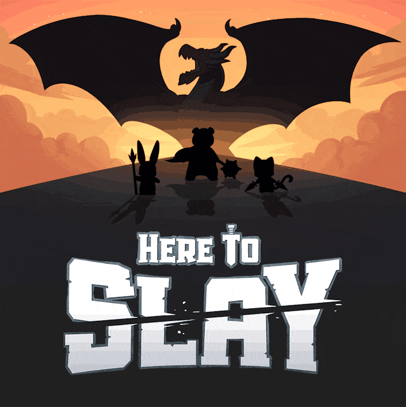

# Here To Slay  
This is a fan-made game of the board game [Here to Slay](https://www.unstablegames.com/collections/here-to-slay)

<!-- Image of the board game -->

  

## Goals / Ideas
* I want to develop the base game as a singleplayer game. (Possible multiplayer in the future? probably not)
* This will be a card game where you fight monsters and assemble a party, and upgrade them with gear!
  * The goal will to follow the rules from the board game and implement the logic from said rules, cards, monsters, and party leaders.

## Game Engine Considerations
* [Unity](https://unity.com/)
    * [Unity Hub](https://unity.com/download)
        * 2022.3.X - [2022.3.17f1](https://unity.com/releases/editor/whats-new/2022.3.17)
        * 2021.3.X - [2021.3.34f1](https://unity.com/releases/editor/whats-new/2021.3.34)
        * Unity [Student](https://unity.com/products/unity-student) is avaible for use instead of Unity [Personal](https://unity.com/pricing/compare-plans)
    * [Unity Multiplayer](https://unity.com/solutions/multiplayer)
* [Godot](https://godotengine.org/)
    * [Latest](https://godotengine.org/download/)
    * [3.5.3 LTS](https://godotengine.org/download/3.x/)

## Acknowledgement
* [Kevin Dang](https://github.com/kevinthedang)

This game is directly inspired by the board game [Here to Slay](https://www.unstablegames.com/collections/here-to-slay) from [Unstable Games](https://www.unstablegames.com/)

[here-to-slay](https://github.com/kevinthedang/here-to-slay) © 2024 by [Kevin Dang](https://github.com/kevinthedang) is licensed under [CC BY-NC 4.0](https://creativecommons.org/licenses/by-nc/4.0/?ref=chooser-v1)